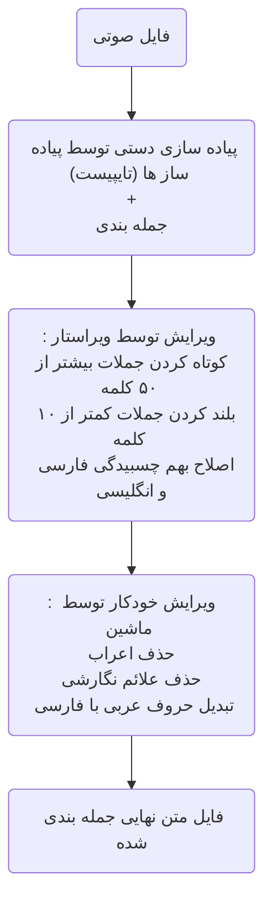

# تحلیل داده

آیشن قصد جمع آوری داده برای بهینه کردن مدل گفتار به متن خود را دارد، داده های مورد نظر بصورت فایل صوتی شامل صحبت یک گوینده و پیاده سازی آن است، برای همین منظور یک خط داده (Data Pipeline) برای تولید و جمع آوری داده های آموزش طراحی کرده ایم که در ادامه آمده است، یک سری فایل صوتی وارد این خط داده شده و خروجی آن را دریافت کرده ایم، 

در این چالش  گزارش ارزیابی داده های تولید شده در اختیار شما قرار می گیرد ، وظیفه شماست که خطاهای موجود را تحلیل کرده و راهکار های برای رفع آن پیشنهاد بدهید 

### خط داده : 

- ورودی خط داده یک فایل صوتی شامل صحبت های یک گوینده و خروجی آن پیاده سازی همان فایل بصورت **جمله به جمله** است (جملات با enter  جدا شده)، در نهایت کارشناس 
ارشد داده، داده های تولید شده را ارزیابی می کند و **خطاهای موجود در هر جمله** را در یک فایل excel به ما گزارش می کند. 
- صوت ها انواع مختلفی دارند که ما به آن دسته می گوییم، دسته الف، ب ، ج و ...
-  

### انواع خطا :‌
1. خطای علائم نگارشی  ( جمله حاوی علائم نگارشی است، علائم نگارشی مثل !،«،} و هر کاراکتر که در الفبای فارسی نیست )
2. خطای اعراب ( جمله حاوی اعراب است مثل  ُ ، ً ، ّ ) 
3. خطای پیاده سازی اشتباه ( جمله حاوی کلمه ای است که در صوت اصلی نیست )
4. خطای بیشتر از ۵۰ کلمه ( جمله بیشتر از ۵۰ کلمه دارد )
5. خطای کمتر از ۱۰ کلمه ( جمله کمتر از ۱۰ کلمه دارد )
6. خطای اعداد به رقم ( جمله حاوی اعدادی است که به رقم نوشته شده اند، مثلا « ارتفاع آب سد ۱۲۰ متر است » در حالی که جمله صحیح باید بصورت «ارتفاع آب سد صد و 
بیست متر است » باشد)
7. خطای کلمات دخیل ( ما از پیاده ساز ها خواسته ایم تا کلمات دخیل را در پیاده سازی خود مشخص کنند، کلمات دخیل کلماتی هستند که ریشه فارسی ندارند اما در بعضی از حوزه های تخصصی در زبان فارسی استفاده می شوند، مثلا کلمه اپلیکشین یک کلمه دخیل است)

### سایر اطاعات مسئله 
1. با صرف هزینه بیشتر می توان پیاده ساز های بهتری استخدام کنیم که احتمالا خطای پیاده سازی اشتباه آنها کمتر است.
2. پیاده سازی را چند ویراستار می توانند ویراستاری کنند، مثلا ابتدا ویراستار الف متن را ویرایش کند و بعد به ویراستار ب بدهد تا او هم ویراستاری کند.
3. خطای کلمات دخیل کمی عجیب است! چون یک پیاده سازی ممکن است کلمه ای را دخیل بداند و دیگری نداند، عجیب تر اینکه کارشناس ارشد داد هم دستورالعمل مشخصی برای تشخیص این کلمات ندارد که در اختیار پیاده سازی بگذارد و سلیقه ای اینکار را انجام می دهد، ولی خب چون فرد با تجربه ای است ما به سلیقه او اعتماد می کنیم!
4. هیچ پیاده ساز و هیچ ویراستاری بدون خطا نیست.
5. در هر دسته باید حداقل ۱۰۰ داده داشته بشیم.
